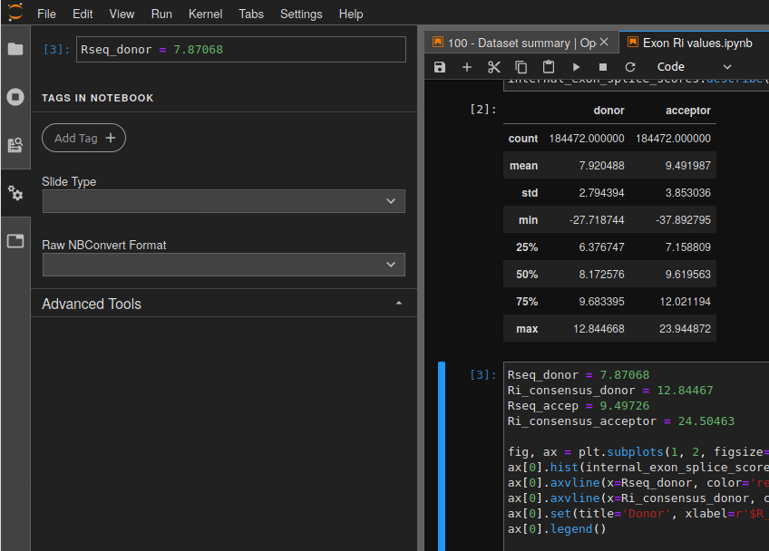
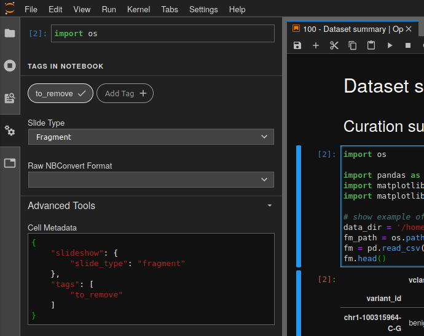

# Jupyter slides

## Make HTML slides from a notebook

- open the notebook in Jupyter Lab

- click on *Property Inspector*

  

- for each cell select the appropriate *Slide Type*

- in order to hide the code and only display figure, add `to_remove` tag to the cell

  

- make HTML file

```bash
jupyter nbconvert Notebook.ipynb --to slides --TagRemovePreprocessor.remove_input_tags={\"to_remove\"} --SlidesExporter.reveal_theme=serif --SlidesExporter.reveal_scroll=True --SlidesExporter.reveal_transition=none
```

> Add `--post serve` if you want to launch a web server for serving the slides instead of creating a HTML file
